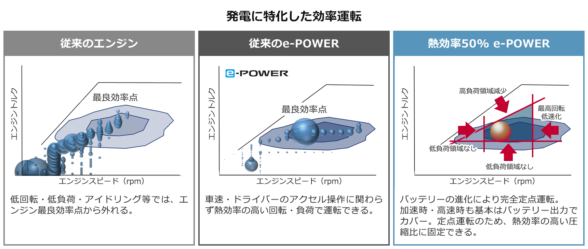
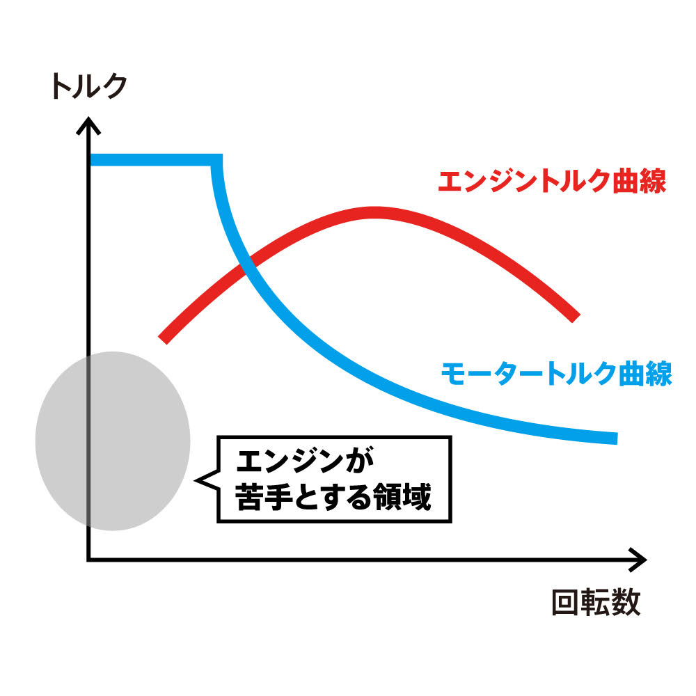
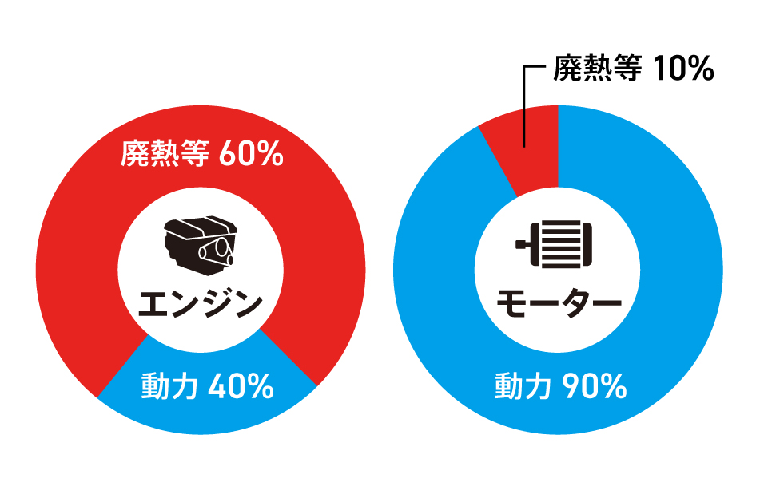
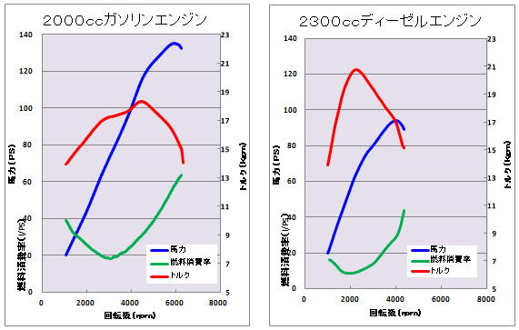

# ポルシェティーガーのガス・エレクトリック方式とe-POWER、電気自動車の相違点

## 結論

ガス・エレクトリック方式とe-POWERは走行用バッテリーを搭載しているか否かであり、技術の進歩によって効率的になった。また、電気自動車と同様に制御も簡単である。しかし、燃料を用いてガソリンで発電するか否かで電気自動車とは違う。

## 動機

電動アシスト自転車から電気自動車に関心を持ち、調べるうちにe-POWERと言われる技術を見つけ、なぜ一見無駄に見える行為をしているのだろうと考えた。また、それに伴い私がプレイしたことがあるゲームに登場するポルシェティーガーを思い出し、二次大戦中からそのような方式を採用するに至った経緯を調べ、現代の電気自動車・エンジン車のメリット・デメリットについて整理したかったためである。

## 比較

1. ポルシェティーガーのメリット・デメリット
2. e-POWERのメリット・デメリット
3. 電気自動車とガソリン車

## ポルシェティーガーについて

ドイツのポルシェティーガー(VK4501(P))は名作戦車として知られるティーガーⅠ(Panzerkampfwagen VI Tiger)と同時に開発され、ティーガーⅠとの採用競争に敗れた試作戦車である。

.svg.png)

この戦車の特異なところはガソリンエンジンで発電し、モータを回すガス・エレクトリック方式が採用されているところである。なぜなら、「加速性能に優れ、左右旋回（操行）も容易な電気式駆動装置が適している」と考えられたからである。

実際に、この方式では左右旋回や操作を行う際に電力の流量で操作するため、ギアの入れ替えやステアリングの利便性が向上する。そのため、当時の運用部隊からの操縦性の評価は高く、変速機の故障も少なかった。

一方、この車体に対して出力不足のエンジンを搭載しており、発電量が不足してしまうという欠点もあった。

このような方式をするに至るまでの経緯として、ポルシェ博士は幼少期から電気に興味を持ち、新型の電気自動車を考案したことなどから、彼の個人的な経験も一因として考えられる。また、ここで電気自動車のほうがガソリン車よりも先に発明されたという知見を得たため、追加Ⅰで歴史と技術的な難易度について調べる。

## 追加Ⅰ:歴史と技術的な難易度について

イェドリク・アーニョシュは1828年に、電動機を模型車両に載せて動かすことに成功し、ロバート・アンダーソンは1830年代に一次電池を搭載した世界初の電気自動車を発明した。

一方、ガソリン車はガソリンエンジンの基礎となる4ストロークエンジンがニコラウス・オットーによって1876年に開発され、世界初のガソリン車はゴットリープ・ダイムラーとヴィルヘルム・マイバッハによって開発された1885年頃にカール・ベンツも開発を成功させ、特許を先に取得したベンツが発明者と言われている。

よって、開発された時期としては電気自動車は1830年代でガソリン車は1885年頃であるため、電気自動車のほうが先に発明されている。

電気自動車の難点として蓄電・送電の技術があり、送電網が整うまでは電気が大幅に使えたわけではなく、バッテリーの技術が未発達であったことから、航続距離の面でもガソリン車に劣っていた。

近年バッテリーの技術が進化し、モーターなどもエンジンに比べて技術的に制作しやすく、電気自動車が安価で制作しやすくなったため、多く市場に出回り始めたと考えられる。

## e-POWERについて

e-POWERはガス・エレクトリック方式とは違い、エンジンで発電した電気をバッテリーに保存し、モーターを動作させる。バッテリーの技術の向上が昔との相違点であり、これによってエンジンをより効率的に利用できるようになった。具体的にはエンジンの最高効率回転数で発電するため、燃費においても、トルク性能的にも有利である。また、モーターのトルク特性より、加減速が素早く、電子制御なのでエンジンに比べてレスポンスが良いことが挙げられる。さらに、日産は熱効率50%の発電専用のガソリンエンジンを開発した。これは、モーターとエンジンの役割を走行と発電に役割分担を行うことで実現している。

[https://www.nissan-global.com/JP/INNOVATION/TECHNOLOGY/ARCHIVE/E_POWER50/](https://www.nissan-global.com/JP/INNOVATION/TECHNOLOGY/ARCHIVE/E_POWER50/ "参考文献")

一方、ポルシェティーガーと同様に、エンジンとモーターを搭載することによって車重が重くなることも挙げられる。

参考としてセレナ(2016年モデル、ハイブリッド車)は燃費が15.0km/L、車重が1630kgほどであり、セレナ(2023年モデル、e-POWER)は燃費が19.3km/L、車重が1810kgほどである。

## 電気自動車とガソリン車

[https://evdays.tepco.co.jp/entry/2022/03/31/000029](https://evdays.tepco.co.jp/entry/2022/03/31/000029"参考文献)

まず環境の点から言うと、モーターが圧倒的に見えるが、火力発電所での効率が30%~50%程度である。電気自動車に供給するまでの効率を考えると、太陽光発電などを利用すれば走行に使う電力で二酸化炭素は発生しないが、製造過程などでの発生量を考えると環境にどちらが良いかはすぐには断言できない。なお、効率の観点からの検討は文献19にて述べられており、当文献によると電気自動車のほうがガソリンハイブリッド車よりも4%ほど効率が高いという結果が出ている。

航続距離としては、e-POWERを搭載したセレナは約800km、比較としてテスラ・モデルYで605kmであり、200km程度有利である。車体の大きさなどを考慮していないが、航続距離に限らず、充電スポットがガソリンスタンドに比べてまだ充実せず、ガソリン車に優勢である。

また、車重の差があり、同じサイズの車であっても電気自動車のほうがおよそ200kg～500kg程重量が大きくなる。

---

## 農業機械は電気式であるべきか

ここまでの資料から、純粋にモーターだけであれば低回転で大きなトルクが出せるため、農作業を行うことに適しているように見える。よって、今回のテーマである農業について、どのような駆動方式を採用するのが良いかということを検討する。

[https://vehicle-cafeteria.com/T04TorqueHorsePower.html]()

動力源については、現在のトラクターはディーゼルエンジンを利用したものが多い。これは図から分かる通り、左のガソリンエンジンよりも右のディーゼルエンジンのほうが最大トルクは大きく、低回転数でそのトルクを発揮するからである。単に馬力のみで言えばガソリンエンジンのほうが大きいが、それを発揮するまでの回転数が必要であると同時に、燃料消費率も高くなってしまう。(燃料消費率とはその仕事を行うために必要な燃料の量を表し、値が小さければ小さいほど良い。)これらの理由からトラクターではディーゼルエンジンを搭載している。では、これをモーターに置き換えるとどうなるか。例としてクボタAgri Roboを挙げる。ここでは、同車種の燃費情報はなかったため、国土交通省による調査結果で車重と総排気量が近似しているものの燃費を採用した。その調査によると6.90km/Lであったため、同車種の燃料タンクの大きさである120Lから、航続距離は828kmとわかる。一方、電気自動車で同程度の航続距離距離を求めるためにeCanter(トラック、三菱ふそう）の電費を用いたところ、1.92km/kWhであった。よって、その航続距離を得るためには431.25kWhのバッテリーが必要である。そのバッテリーの重量はリチウムイオン二次電池のエネルギー密度である155Wh/kgを用いると、2782.26kgと算出できる。よって、およそ2.7tのバッテリーが必要である。このバッテリーの重量は車体総重量に見合わない程重い。そのため、同程度の航続距離はすぐには実現できず、航続距離を短くするにしても、まだ課題は多い。

また、充電にかかる時間もデメリットの一つである。2023年、クボタは電動小型トラクターを開発した。このトラクターは1時間の急速充電で3−4時間ほどの連続稼働ができるとしているが、現在のトラクターであれば給油はは5−10分程度ですべて完了してしまうため、まだエンジンに充電時間の面でも劣っている。そのため、クボタは水素燃料による燃料電池式のトラクターの開発を進めており、2030年までに実用化を目指している。

一方、静音性能という面では電気式に軍配が上がる。例えば、町中の公園での作業であったり、住宅地に近隣する畑作業を行うことを考える。電気式のトラクターであれば、早朝からの作業や日中の騒音被害を低減できる。

そして、トルク面ではモーターとディーゼルエンジンのそれぞれのメリット・デメリットがあるが、変速機が簡略化できるためモーターのほうが制御しやすいとも考えられる。どれほど高トルクをモーターが出せるか、という点が今後の課題となる。

よって、結論としては現状の電気式のトラクターは市街地などの小規模の作業ではエンジン式よりも勝っており、大規模な圃場であったとしてもバッテリーではない電気式のトラクターは将来的に出現し、徐々に浸透していくと考えられる。

---

参考文献:

1. [https://ja.wikipedia.org/wiki/VK4501(P)](https://ja.wikipedia.org/wiki/VK4501(P))
2. [https://ja.wikipedia.org/wiki/ガス・エレクトリック方式](https://ja.wikipedia.org/wiki/%E3%82%AC%E3%82%B9%E3%83%BB%E3%82%A8%E3%83%AC%E3%82%AF%E3%83%88%E3%83%AA%E3%83%83%E3%82%AF%E6%96%B9%E5%BC%8F)
3. [https://ja.wikipedia.org/wiki/ディーゼル・エレクトリック方式](https://ja.wikipedia.org/wiki/%E3%83%87%E3%82%A3%E3%83%BC%E3%82%BC%E3%83%AB%E3%83%BB%E3%82%A8%E3%83%AC%E3%82%AF%E3%83%88%E3%83%AA%E3%83%83%E3%82%AF%E6%96%B9%E5%BC%8F)
4. [https://ja.wikipedia.org/wiki/フェルディナント・ポルシェ](https://ja.wikipedia.org/wiki/%E3%83%95%E3%82%A7%E3%83%AB%E3%83%87%E3%82%A3%E3%83%8A%E3%83%B3%E3%83%88%E3%83%BB%E3%83%9D%E3%83%AB%E3%82%B7%E3%82%A7)
5. [https://ja.wikipedia.org/wiki/電気自動車](https://ja.wikipedia.org/wiki/%E9%9B%BB%E6%B0%97%E8%87%AA%E5%8B%95%E8%BB%8A#:~:text=%E5%8F%96%E5%BE%97%E3%81%95%E3%82%8C%E3%81%9F%E3%80%82-,%E9%9B%BB%E6%B0%97%E8%87%AA%E5%8B%95%E8%BB%8A%E3%81%AE%E6%AD%B4%E5%8F%B2%E3%81%AE%E5%A7%8B%E3%81%BE%E3%82%8A,%E9%9B%BB%E6%B0%97%E8%87%AA%E5%8B%95%E8%BB%8A%E3%82%92%E7%99%BA%E6%98%8E%E3%81%97%E3%81%9F%E3%80%82)
6. [https://global.toyota/jp/kids/history/automobile/](https://global.toyota/jp/kids/history/automobile/)
7. [https://www.nextage.jp/gaisya_guide/recommend/269018/](https://www.nextage.jp/gaisya_guide/recommend/269018/#:~:text=1885%E5%B9%B4%EF%BC%9A%E3%82%AC%E3%82%BD%E3%83%AA%E3%83%B3%E8%87%AA%E5%8B%95%E8%BB%8A%E3%81%8C%E7%99%BA%E6%98%8E%E3%81%95%E3%82%8C%E3%82%8B&text=%E8%A9%A6%E8%A1%8C%E9%8C%AF%E8%AA%A4%E3%82%92%E9%87%8D%E3%81%AD%E3%80%81%E5%9B%9B,%E3%83%99%E3%83%B3%E3%83%84%E3%81%A8%E3%81%95%E3%82%8C%E3%81%A6%E3%81%84%E3%81%BE%E3%81%99%E3%80%82)
8. [https://www.jsae.or.jp/engine_rev/column/c_13-05.html](https://www.jsae.or.jp/engine_rev/column/c_13-05.html)
9. [https://www2.nissan.co.jp/BRAND/EPOWER/](https://www2.nissan.co.jp/BRAND/EPOWER/)
10. [https://新型セレナ.net/e-power/serena-e-power-kouzokukyori.html](https://xn--1ck4axg801pj1o.net/e-power/serena-e-power-kouzokukyori.html)
11. [https://www.tesla.com/ja_jp/support/range-calculator-ref](https://www.tesla.com/ja_jp/support/range-calculator-ref)
12. [https://xtech.nikkei.com/atcl/nxt/column/18/00138/060701057/](https://xtech.nikkei.com/atcl/nxt/column/18/00138/060701057/)
13. [https://xtech.nikkei.com/atcl/nxt/mag/nmc/18/00115/00003/](https://xtech.nikkei.com/atcl/nxt/mag/nmc/18/00115/00003/#:~:text=%E4%B8%80%E8%88%AC%E3%81%AB%E3%80%81%E3%82%A8%E3%83%B3%E3%82%B8%E3%83%B3%E3%81%AB%E3%81%AF%E6%9C%80%E3%82%82,%E3%81%AF70%EF%BD%9E80Nm%E3%81%A0%E3%80%82)
14. [https://ja.wikipedia.org/wiki/ハイブリッドカー](https://ja.wikipedia.org/wiki/%E3%83%8F%E3%82%A4%E3%83%96%E3%83%AA%E3%83%83%E3%83%89%E3%82%AB%E3%83%BC#%E3%82%B7%E3%83%AA%E3%83%BC%E3%82%BA%E6%96%B9%E5%BC%8F)
15. [https://ja.wikipedia.org/wiki/二次電池式電気自動車](https://ja.wikipedia.org/wiki/%E4%BA%8C%E6%AC%A1%E9%9B%BB%E6%B1%A0%E5%BC%8F%E9%9B%BB%E6%B0%97%E8%87%AA%E5%8B%95%E8%BB%8A)
16. [https://evdays.tepco.co.jp/entry/2022/03/31/000029](https://evdays.tepco.co.jp/entry/2022/03/31/000029)
17. [https://vehicle-cafeteria.com/T04TorqueHorsePower.html](https://vehicle-cafeteria.com/T04TorqueHorsePower.html)
18. [https://kimura.ez.u-tokai.ac.jp/kimura-lab/ev/record.html](https://kimura.ez.u-tokai.ac.jp/kimura-lab/ev/record.html)
19. [https://car.watch.impress.co.jp/docs/news/1308862.html](https://car.watch.impress.co.jp/docs/news/1308862.html)
20. [https://www.dir.co.jp/report/column/20230113_010985.html](https://www.dir.co.jp/report/column/20230113_010985.html)
21. [https://blog.evsmart.net/electric-vehicles/electric-vehicles-are-more-efficient-than-ice/](https://blog.evsmart.net/electric-vehicles/electric-vehicles-are-more-efficient-than-ice/)
22. [https://www.dir.co.jp/report/column/20230113_010985.html](https://www.dir.co.jp/report/column/20230113_010985.html)
23. [https://www.mlit.go.jp/common/000111224.pdf](https://www.mlit.go.jp/common/000111224.pdf)
24. [https://agriculture.kubota.co.jp/img_sys/specifications/f77d89104860913cef764b8858800447/2-30-2-0035-02_spec.pdf](https://agriculture.kubota.co.jp/img_sys/specifications/f77d89104860913cef764b8858800447/2-30-2-0035-02_spec.pdf)
25. [https://edu.yz.yamagata-u.ac.jp/developer/WebClass/@WebClassEssayQuestionAnswerIFrame.asp](https://edu.yz.yamagata-u.ac.jp/developer/WebClass/@WebClassEssayQuestionAnswerIFrame.asp?id=66)
26. [https://www.mitsubishi-fuso.com/wp-content/uploads/2019/09/ecanter.pdf](https://www.mitsubishi-fuso.com/wp-content/uploads/2019/09/ecanter.pdf)
27. [https://www.webcartop.jp/2022/07/931953/](https://www.webcartop.jp/2022/07/931953/)
28. [https://www.n-nets.co.jp/product/lithium.html](https://www.n-nets.co.jp/product/lithium.html)
29. [https://fullload.bestcarweb.jp/news/365202](https://fullload.bestcarweb.jp/news/365202)
30. [https://hatakemon.com/electric_tractor_solectrac/](https://hatakemon.com/electric_tractor_solectrac/)